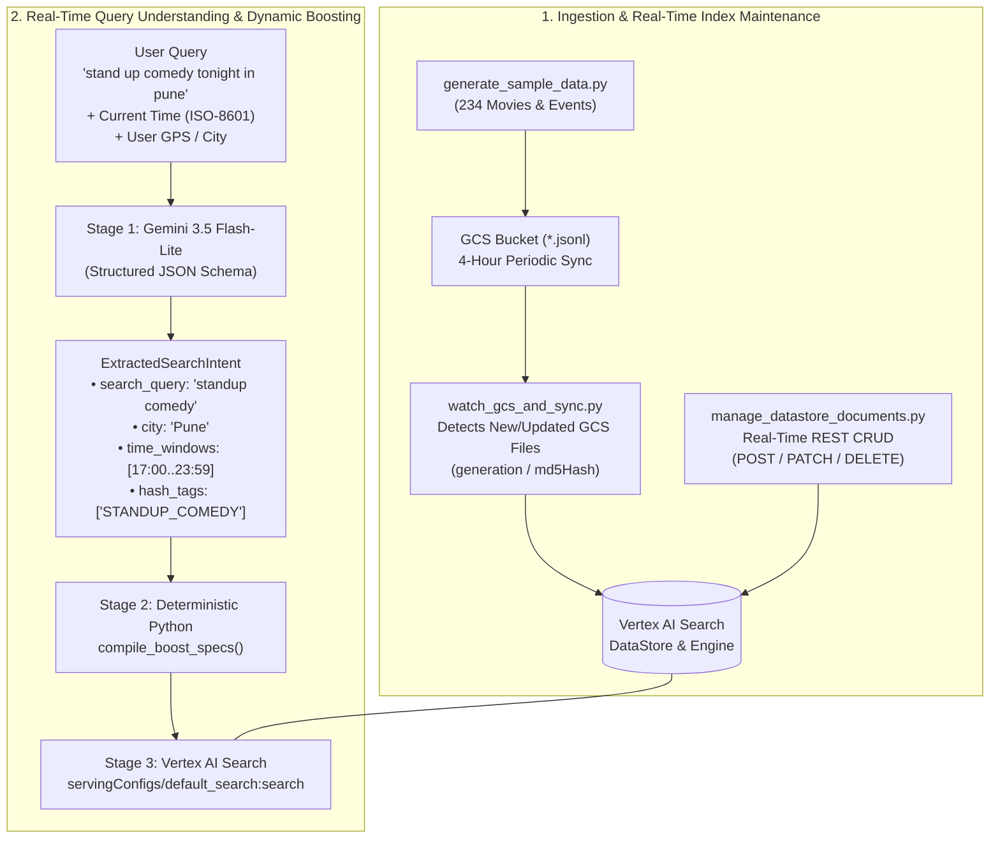

# Vertex AI Search — Real-Time Entertainment Discovery, Dynamic Boosting & Document CRUD

An end-to-end reference implementation for **movies and live entertainment discovery** powered by **Google Cloud Vertex AI Search (Discovery Engine)** and **Gemini 3.5 Flash-Lite**.

This repository demonstrates how to:
1. **Provision & Sync a Vertex AI Search DataStore** with a 4-hour periodic GCS DataConnector (`14400s`) and an Enterprise Search Engine.
2. **Perform Real-Time Document CRUD** (`Create`, `Batch Inline Import`, `GET + PATCH Modify`, and `DELETE`) directly against the Discovery Engine `documents` REST API without waiting for periodic GCS syncs.
3. **Rank Results by Geolocation Proximity** using concentric `location_city:GEO_DISTANCE(lat, lng, radius_meters)` rings inside `conditionBoostSpecs`.
4. **Translate Natural-Language & Hinglish Queries in Real Time** (`"stand up comedy tonight in pune"`, `"is weekend delhi mein kya chal raha hai"`, `"pottery classes every saturday in october"`) into structured search intents via **Gemini 3.5 Flash-Lite** and compile them deterministically into zero-error Vertex AI Search `boostSpec` conditions.

---

## Table of Contents

1. [Repository Structure](#1-repository-structure)
2. [System Architecture](#2-system-architecture)
3. [Configuration & Setup](#3-configuration--setup)
4. [Dataset Schema & Indexed Fields](#4-dataset-schema--indexed-fields)
5. [Geolocation Boosting (`GEO_DISTANCE` Concentric Rings)](#5-geolocation-boosting-geo_distance-concentric-rings)
6. [Real-Time Query-to-Boost Pipeline (Gemini + Deterministic Compiler)](#6-real-time-query-to-boost-pipeline-gemini--deterministic-compiler)
7. [Benchmark Evaluation Summary (12 Natural-Language Queries)](#7-benchmark-evaluation-summary-12-natural-language-queries)
8. [Latency Benchmark Report (`Single Query` vs. `Real-Time LLM Pipeline`)](#8-latency-benchmark-report-single-query-vs-real-time-llm-pipeline)
9. [DataStore Document CRUD Guide (Create, Batch Insert, Modify, Delete)](#9-datastore-document-crud-guide-create-batch-insert-modify-delete)
10. [Automated GCS Folder Watcher & Instant DataStore Sync](#10-automated-gcs-folder-watcher--instant-datastore-sync)
11. [Quickstart & CLI Usage](#11-quickstart--cli-usage)

---

## 1. Repository Structure

| File | Purpose |
| :--- | :--- |
| [`config.py`](./config.py) | Centralized configuration loader reading from environment variables or git-ignored `config.local.json` with safe fallback defaults. |
| [`config.example.json`](./config.example.json) | Template configuration file containing placeholder GCP project, GCS, Discovery Engine, and Gemini model settings. |
| [`generate_sample_data.py`](./generate_sample_data.py) | Deterministic dataset generator producing **234 structured entertainment records** (113 movies + 121 live events across 8 Indian cities) in [`sample_metadata_200.json`](./sample_metadata_200.json). |
| [`setup_gcs_datastore.py`](./setup_gcs_datastore.py) | Converts JSON to JSONL, uploads to GCS, provisions the Discovery Engine GCS DataConnector (`PERIODIC` 4-hour sync) and Enterprise Search Engine, and verifies live search. |
| [`watch_gcs_and_sync.py`](./watch_gcs_and_sync.py) | Watches `gs://{GCS_BUCKET}/{GCS_FOLDER}/*.jsonl` for newly uploaded or modified `.jsonl` files (tracking GCS `generation` & `md5Hash`) and immediately triggers a Vertex AI Search DataStore import + connector sync. |
| [`cloud_function_gcs_sync/`](./cloud_function_gcs_sync/) | Serverless **2nd-Gen Cloud Run Function** (`main.py`, `requirements.txt`, `deploy.sh`) triggered by Eventarc (`google.cloud.storage.object.v1.finalized`) whenever a `.jsonl` file is uploaded to GCS. |
| [`manage_datastore_documents.py`](./manage_datastore_documents.py) | Real-time Document CRUD script demonstrating single creation (`POST`), batch inline import (`POST :import`), partial field modification (`GET` + `PATCH`), and deletion (`DELETE`). |
| [`query_with_boost.py`](./query_with_boost.py) | Evaluates concentric `GEO_DISTANCE` proximity boosting and runs all 12 natural-language benchmark queries comparing baseline vs. boosted rankings. |
| [`realtime_query_benchmark.py`](./realtime_query_benchmark.py) | End-to-end latency benchmark comparing **Single Query (Direct Search)** vs. **Real-Time Query Resolution (Gemini 3.5 Flash-Lite + Python Boost Compiler + Search)**. |
| [`sample_metadata_200.json`](./sample_metadata_200.json) | Generated dataset of 234 movies and live events with geolocation coordinates, ISO-8601 `+05:30` showtimes, release dates, languages, formats, and hashtags. |

---

## 2. System Architecture



---

## 3. Configuration & Setup

All project-specific identifiers and credentials are loaded from `config.local.json` (git-ignored) or environment variables via [`config.py`](./config.py). No project IDs, app names, or account emails are hardcoded in version-controlled files.

```bash
# 1. Copy the template configuration
cp config.example.json config.local.json

# 2. Edit config.local.json with your GCP project, GCS bucket, and Vertex AI Search IDs
```

### Configuration Keys & Environment Variables

| `config.local.json` Key | Environment Variable | Default / Placeholder | Description |
| :--- | :--- | :--- | :--- |
| `project_id` | `GCP_PROJECT_ID` | `your-gcp-project-id` | Google Cloud Project ID |
| `project_number` | `GCP_PROJECT_NUMBER` | `000000000000` | Google Cloud Project Number |
| `location` | `DISCOVERY_ENGINE_LOCATION` | `global` | Discovery Engine location (`global`, `us`, `eu`) |
| `vertex_ai_location` | `VERTEX_AI_LOCATION` | `us-central1` | Vertex AI Gemini endpoint region |
| `gcs_bucket` | `GCS_BUCKET` | `your-gcs-bucket-name` | GCS bucket used for JSONL staging |
| `gcs_folder` | `GCS_FOLDER` | `sample_search_data` | GCS folder prefix for JSONL files |
| `collection_id` | `COLLECTION_ID` | `sample-data-connector` | Discovery Engine Collection / DataConnector ID |
| `datastore_id` | `DATASTORE_ID` | `sample-data-connector_gcs_store` | Vertex AI Search DataStore ID |
| `engine_id` | `SEARCH_ENGINE_ID` | `your-search-engine-id` | Vertex AI Search Engine (App) ID |
| `refresh_interval_seconds` | `REFRESH_INTERVAL_SECONDS` | `14400s` | Periodic GCS sync interval (`14400s` = 4 hours) |
| `gcloud_account` | `GCLOUD_ACCOUNT` | `""` | Optional `gcloud` account for mTLS / CBA fallback |
| `gemini_model` | `GEMINI_MODEL` | `gemini-3.5-flash-lite` | Gemini model used for real-time intent extraction |

---

## 4. Dataset Schema & Indexed Fields

The dataset ([`sample_metadata_200.json`](./sample_metadata_200.json)) contains **234 records** across **8 Indian cities** (`Mumbai`, `Delhi NCR`, `Bengaluru`, `Hyderabad`, `Chennai`, `Pune`, `Kolkata`, `Goa`):
* **113 Movies (`MV00001` – `MV00113`)**: 100 base listings + 13 targeted benchmark listings.
* **121 Live Events (`etm100000z` – `etm100120z`)**: 100 base listings + 21 targeted benchmark listings.

### Key Schema Fields for Filtering & Boosting

| Field Name | Vertex AI Search Type | Example Value | Usage in `conditionBoostSpecs` |
| :--- | :--- | :--- | :--- |
| `id` / `_id` | `STRING` (Primary Key) | `"MV00102"`, `"etm100104z"` | Document ID for CRUD & deduplication |
| `record_type` | `STRING` (Filterable) | `"movie"` \| `"event"` | `record_type: ANY("movie")` |
| `location_city` | `GEOLOCATION` | `{"address": "Pune, Maharashtra, India"}` | `location_city:GEO_DISTANCE(18.5204, 73.8567, 50000)` |
| `location_latlng` | `OBJECT` (`lat`, `lng`) | `{"lat": 18.4892, "lng": 73.8205}` | Client-side Haversine distance verification |
| `showtime_start` | `DATETIME` (RFC3339) | `"2026-10-07T20:00:00+05:30"` | `showtime_start >= "2026-10-07T17:00:00+05:30"` |
| `release_date` | `DATETIME` (RFC3339) | `"2026-10-09T00:00:00+05:30"` | `release_date >= "2026-10-09T00:00:00+05:30"` |
| `languages` | `ARRAY<STRING>` | `["Hindi", "Telugu"]` | `languages: ANY("Telugu")` |
| `searchKeywords` | `ARRAY<STRING>` | `["stand up comedy", "pune", "tonight"]` | `searchKeywords: ANY("stand up comedy")` |
| `hash_tags` | `ARRAY<STRING>` | `["STANDUP_COMEDY", "TONIGHT"]` | `hash_tags: ANY("STANDUP_COMEDY")` |
| `formats` | `ARRAY<STRING>` | `["2D", "IMAX 2D", "4DX"]` | Display & format filtering |

---

## 5. Geolocation Boosting (`GEO_DISTANCE` Concentric Rings)

In Vertex AI Search, `location_city:GEO_DISTANCE(lat, lng, radius_meters)` inside `conditionBoostSpecs` is a **boolean circle predicate** — it is **not** a continuous distance-decay function:
* Every document inside `radius_meters` receives the exact same flat boost.
* Setting a single large radius like `radius_meters = 5000000` (`5,000 km`) places every Indian city inside the same circle, giving them identical boost scores and leaving relative ranking unchanged.

### Solution: Stacking Concentric `GEO_DISTANCE` Rings
By stacking multiple concentric circles in `conditionBoostSpecs`, closer venues match more rings and accumulate a higher cumulative boost score:

```json
[
  {"condition": "location_city:GEO_DISTANCE(13.0827, 80.2707, 100000)",  "boost": 0.4},
  {"condition": "location_city:GEO_DISTANCE(13.0827, 80.2707, 800000)",  "boost": 0.3},
  {"condition": "location_city:GEO_DISTANCE(13.0827, 80.2707, 1150000)", "boost": 0.2},
  {"condition": "location_city:GEO_DISTANCE(13.0827, 80.2707, 1500000)", "boost": 0.1}
]
```

**Verified Distance Ranking for `"Welcome to the Jungle"` from Chennai (`13.0827, 80.2707`):**
1. **Chennai (`3.3 km`)** — Matches all 4 rings (`100km`, `800km`, `1150km`, `1500km`) $\rightarrow$ **Rank #1** (`[MV00098]`)
2. **Goa (`744.3 km`)** — Matches 3 rings (`800km`, `1150km`, `1500km`) $\rightarrow$ **Rank #2** (`[MV00099]`)
3. **Mumbai (`1031.8 km`)** — Matches 2 rings (`1150km`, `1500km`) $\rightarrow$ **Rank #3** (`[MV00096]`)
4. **Kolkata (`1355.6 km`)** — Matches 1 ring (`1500km`) $\rightarrow$ **Rank #4** (`[MV00097]`)
5. **Delhi NCR (`1746.3 km`)** — Matches 0 rings $\rightarrow$ **Rank #5** (`[MV00100]`)

---

## 6. Real-Time Query-to-Boost Pipeline (Gemini + Deterministic Compiler)

> [!IMPORTANT]
> **Never ask an LLM to write raw Vertex AI Search `boostSpec` filter strings directly.** LLMs can hallucinate schema field names, omit quotes, or generate invalid date/geolocation syntax. Instead, use a **2-stage pipeline**:
> 1. **Stage 1 (LLM Intent Extraction)**: Constrain `gemini-3.5-flash-lite` with a strict `responseSchema` (`ExtractedSearchIntent`) and pass the current ISO-8601 timestamp in the system prompt so relative dates (`"tonight"`, `"this friday"`, `"every saturday in october"`) resolve to exact ISO-8601 windows.
> 2. **Stage 2 (Deterministic Boost Compiler)**: Compile the validated `ExtractedSearchIntent` object into guaranteed-valid Vertex AI Search `conditionBoostSpecs` in Python (~20 microseconds).

### Stage 1: Structured Intent Schema (`ExtractedSearchIntent`)

```python
class TimeWindow(BaseModel):
    start_iso: str = Field(
        description="ISO-8601 start timestamp with +05:30 offset, e.g. 2026-10-07T17:00:00+05:30"
    )
    end_iso: str = Field(
        description="ISO-8601 end timestamp with +05:30 offset, e.g. 2026-10-07T23:59:59+05:30"
    )


class ExtractedSearchIntent(BaseModel):
    search_query: str
    record_type: Optional[Literal["movie", "event"]] = None
    city: Optional[
        Literal["Mumbai", "Delhi NCR", "Bengaluru", "Hyderabad", "Chennai", "Pune", "Kolkata", "Goa"]
    ] = None
    languages: List[str] = Field(default_factory=list)
    audience: Optional[Literal["kids", "family", "adults"]] = None
    keywords: List[str] = Field(default_factory=list)
    hash_tags: List[
        Literal[
            "MORNING_SHOW", "LATE_NIGHT_SHOW", "NEW_RELEASE", "FRIDAY_RELEASE",
            "UPCOMING_MOVIE", "KIDS_EVENT", "OPEN_MIC", "STANDUP_COMEDY",
            "GARBA_NIGHT", "NEW_YEAR_EVE", "STAGE_PLAY", "POTTERY_WORKSHOP",
            "SATURDAY_OCTOBER",
        ]
    ] = Field(default_factory=list)
    date_field: Literal["showtime_start", "release_date"] = "showtime_start"
    time_windows: List[TimeWindow] = Field(default_factory=list)
```

### Stage 2: Deterministic Boost Compiler (`compile_boost_specs`)

```python
def compile_boost_specs(
    intent: ExtractedSearchIntent,
    user_latlng: Optional[Tuple[float, float]] = None,
) -> List[Dict[str, Any]]:
    specs: List[Dict[str, Any]] = []

    # 1. Record Type + Language Boost
    type_clauses = []
    if intent.record_type:
        type_clauses.append(f'record_type: ANY("{intent.record_type}")')
    if intent.languages:
        langs = ", ".join(f'"{l}"' for l in intent.languages)
        type_clauses.append(f"languages: ANY({langs})")
    if type_clauses:
        specs.append({"condition": " AND ".join(type_clauses), "boost": 0.6})

    # 2. Genre / Audience Keywords & Hashtags Boost
    if intent.keywords or intent.hash_tags:
        kw_clauses = []
        if intent.keywords:
            kws = ", ".join(f'"{k.lower()}"' for k in intent.keywords)
            kw_clauses.append(f"searchKeywords: ANY({kws})")
        if intent.hash_tags:
            tags = ", ".join(f'"{t}"' for t in intent.hash_tags)
            kw_clauses.append(f"hash_tags: ANY({tags})")
        specs.append({"condition": " OR ".join(kw_clauses), "boost": 0.6})

    # 3. Location Boost (Explicit city in query OR concentric rings around user GPS)
    if intent.city and intent.city in CITY_COORDS:
        lat, lng = CITY_COORDS[intent.city]
        specs.append({"condition": f"location_city:GEO_DISTANCE({lat}, {lng}, 50000)", "boost": 0.8})
    elif user_latlng:
        lat, lng = user_latlng
        for radius_m, boost_val in [(50000, 0.4), (300000, 0.3), (800000, 0.2), (1500000, 0.1)]:
            specs.append({"condition": f"location_city:GEO_DISTANCE({lat}, {lng}, {radius_m})", "boost": boost_val})

    # 4. Date / Time Window Boost (supports single range OR recurring days like 'every Saturday')
    if intent.time_windows:
        field = intent.date_field
        window_clauses = [
            f'({field} >= "{w.start_iso}" AND {field} <= "{w.end_iso}")'
            for w in intent.time_windows
        ]
        specs.append({"condition": " OR ".join(window_clauses), "boost": 0.9})

    return specs
```

---

## 7. Benchmark Evaluation Summary (12 Natural-Language Queries)

All 12 queries and their baseline vs. boosted rankings are implemented in [`query_with_boost.py`](./query_with_boost.py):

| # | User Query | Extracted Intent Fields | Compiled `conditionBoostSpecs` | Ranking Improvement (Baseline $\rightarrow$ Boosted) |
| :--- | :--- | :--- | :--- | :--- |
| **Q1** | `open mic next week` | `what: open mic`, `when: next week` | `searchKeywords: ANY("open mic")` + `showtime_start` in `2026-10-12..18` | Nov 22 distractor (`etm100100z`) drops **#1 $\rightarrow$ #3**; Oct 16 & Oct 14 open mics move to **#1 & #2** |
| **Q2** | `stand up comedy tonight in pune` | `what: stand up comedy`, `when: tonight`, `where: pune` | `location_city:GEO_DISTANCE(18.5204, 73.8567, 50000)` + `showtime_start` tonight (`2026-10-07`) | Tonight's Pune shows (`etm100104z`, `etm100103z`, `5.2km`) take **#1 & #2** ahead of Mumbai (`122.2km`) |
| **Q3** | `movies releasing this friday` | `what: movie`, `when: this friday` | `record_type: ANY("movie")` + `release_date` on `2026-10-09` + `hash_tags: ANY("FRIDAY_RELEASE")` | Older Sep 11 release (`MV00101`) drops **#1 $\rightarrow$ #3**; Oct 9 Friday releases (`MV00102`, `MV00103`) move to **#1 & #2** |
| **Q4** | `kids events this sunday morning` | `what: events`, `audience: kids`, `when: sunday morning` | `record_type: ANY("event") AND searchKeywords: ANY("kids", ...)` + `showtime_start` on `2026-10-11T06:00..12:00` | General evening festivals drop out of top 4; Sunday morning kids workshops (`etm100106z` 10:00 AM, `etm100105z` 09:30 AM) rise to **#1 & #2** |
| **Q5** | `late night shows after 10 pm` | `what: movie`, `when: after 10 pm` | `record_type: ANY("movie") AND hash_tags: ANY("LATE_NIGHT_SHOW")` + `showtime_start >= 22:00` | Morning/evening shows replaced at **#1–#4** by post-10 PM shows (`MV00106` 23:15, `MV00105` 22:45, `MV00045` 22:30, `MV00018` 22:30) |
| **Q6** | `garba nights between 10th and 20th october` | `what: garba night`, `when: 10th to 20th october` | `searchKeywords: ANY("garba", ...)` + `showtime_start` in `2026-10-10..20` | Oct 12 (`etm100108z`) and Oct 17 (`etm100109z`) Garba Nights rank **#1 & #2** ahead of Oct 28 distractor (`etm100107z`) |
| **Q7** | `new year eve parties in goa` | `what: party`, `when: new year eve`, `where: goa` | `location_city:GEO_DISTANCE(15.4989, 73.8278, 50000)` + `showtime_start` on `2026-12-31` | Mumbai NYE party (`etm100110z`, `404.8km`) drops **#1 $\rightarrow$ #3**; Goa NYE parties (`etm100112z`, `etm100111z`, `15.3km`) move to **#1 & #2** |
| **Q8** | `is weekend delhi mein kya chal raha hai` | `what: events`, `when: this weekend`, `where: delhi` | `record_type: ANY("event") AND location_city:GEO_DISTANCE(28.6139, 77.2090, 50000)` + `showtime_start` in `2026-10-10..11` | Delhi NCR weekend events (`etm100113z` Oct 10, `etm100114z` Oct 11, `4.2km`) rank **#1 & #2** |
| **Q9** | `upcoming telugu movies next month` | `what: movie`, `language: telugu`, `when: next month` | `record_type: ANY("movie") AND languages: ANY("Telugu")` + `release_date` in `2026-11-01..30` | Oct 1 release (`MV00107`) drops **#2 $\rightarrow$ #4**; all three Nov 2026 Telugu releases (`MV00108`, `MV00110`, `MV00109`) take **#1, #2, #3** |
| **Q10** | `morning shows tomorrow before 11` | `what: movie`, `when: tomorrow before 11` | `record_type: ANY("movie") AND hash_tags: ANY("MORNING_SHOW")` + `showtime_start` in `2026-10-08T06:00..11:00` | Tomorrow's morning shows (`MV00112` at `09:00` and `MV00113` at `10:15` on `2026-10-08`) jump to **#1 & #2** |
| **Q11** | `plays on gandhi jayanti holiday` | `what: play`, `when: 2nd october` | `searchKeywords: ANY("play", "theatre", ...)` + `showtime_start` on `2026-10-02` | Oct 25 play (`etm100115z`) drops **#2 $\rightarrow$ #3**; both Oct 2 Gandhi Jayanti plays (`etm100117z`, `etm100116z`) rank **#1 & #2** |
| **Q12** | `pottery classes every saturday in october` | `what: pottery workshop`, `when: every saturday in october` | `searchKeywords: ANY("pottery", ...)` + `hash_tags: ANY("SATURDAY_OCTOBER")` / Saturday `showtime_start` ranges | Saturday October pottery workshops (`etm100119z` Oct 10, `etm100120z` Oct 17) rank **#1 & #2** ahead of Nov 11 Wednesday workshop (`etm100118z`) |

---

## 8. Latency Benchmark Report (`Single Query` vs. `Real-Time LLM Pipeline`)

[`realtime_query_benchmark.py`](./realtime_query_benchmark.py) measures live latencies (after TCP/mTLS warm-up) across two execution modes for all 12 benchmark queries:

1. **Single Query Mode (`Single Query (ms)`)**: Direct Vertex AI Search API call (`engines/{ENGINE_ID}/servingConfigs/default_search:search`) with a pre-built query and `boostSpec`.
2. **Real-Time Query Resolution Mode (`RT Total E2E (ms)`)**:
   * **LLM Extract (`LLM Extract (ms)`)**: Live call to `gemini-3.5-flash-lite` (`thinkingBudget: 0`, structured `responseSchema`) to parse the raw natural-language query into `ExtractedSearchIntent`.
   * **Boost Compile (`Compile (ms)`)**: Deterministic Python `compile_boost_specs(intent)` execution.
   * **RT Search (`RT Search (ms)`)**: Live Vertex AI Search API call using the dynamically extracted `search_query` and compiled `conditionBoostSpecs`.

### 8.1 Per-Query Latency Breakdown (`gemini-3.5-flash-lite`)

| ID | User Query | Single Query (ms) | LLM Extract (ms) | Compile (ms) | RT Search (ms) | RT Total E2E (ms) | Real-Time Top-1 Result |
| :--- | :--- | ---: | ---: | ---: | ---: | ---: | :--- |
| **Q1** | `open mic next week` | `353.7 ms` | `1746.2 ms` | `0.044 ms` | `348.7 ms` | **`2094.9 ms`** | `[etm100102z]` BLR Brewing Acoustic & Standup Open Mic (Bengaluru) |
| **Q2** | `stand up comedy tonight in pune` | `348.9 ms` | `1679.5 ms` | `0.014 ms` | `328.9 ms` | **`2008.4 ms`** | `[etm100104z]` Bassi Kisi Ko Batana Mat Stand Up Comedy (Pune) |
| **Q3** | `movies releasing this friday` | `331.4 ms` | `1857.2 ms` | `0.010 ms` | `362.9 ms` | **`2220.1 ms`** | `[MV00102]` Bhool Bhulaiyaa 4 (Delhi NCR) |
| **Q4** | `kids events this sunday morning` | `313.3 ms` | `2254.1 ms` | `0.007 ms` | `312.5 ms` | **`2566.6 ms`** | `[etm100106z]` Junior Robotics & Science Kids Workshop (Bengaluru) |
| **Q5** | `late night shows after 10 pm` | `260.4 ms` | `2283.0 ms` | `0.023 ms` | `318.9 ms` | **`2601.9 ms`** | `[MV00106]` The Batman Part II (Bengaluru) |
| **Q6** | `garba nights between 10th and 20th october` | `277.4 ms` | `1807.5 ms` | `0.017 ms` | `272.4 ms` | **`2079.9 ms`** | `[etm100108z]` Falguni Pathak Navratri Garba Nights (Mumbai) |
| **Q7** | `new year eve parties in goa` | `328.6 ms` | `2292.9 ms` | `0.022 ms` | `275.9 ms` | **`2568.9 ms`** | `[etm100112z]` Thalassa Sunset to Sunrise NYE Party (Goa) |
| **Q8** | `is weekend delhi mein kya chal raha hai` | `259.0 ms` | `1708.1 ms` | `0.050 ms` | `286.0 ms` | **`1994.2 ms`** | `[etm100113z]` Delhi Sufi & Street Food Festival (Delhi NCR) |
| **Q9** | `upcoming telugu movies next month` | `289.5 ms` | `1633.1 ms` | `0.029 ms` | `380.9 ms` | **`2014.0 ms`** | `[MV00108]` Devara Part 2: Red Sea (Hyderabad) |
| **Q10** | `morning shows tomorrow before 11` | `269.1 ms` | `1648.8 ms` | `0.010 ms` | `745.0 ms` | **`2393.8 ms`** | `[MV00112]` Chhaava: The Great Warrior (Mumbai) |
| **Q11** | `plays on gandhi jayanti holiday` | `270.7 ms` | `2274.4 ms` | `0.022 ms` | `274.9 ms` | **`2549.3 ms`** | `[etm100117z]` Tughlaq: Theatre Play (Mumbai) |
| **Q12** | `pottery classes every saturday in october` | `275.3 ms` | `2282.3 ms` | `0.031 ms` | `270.7 ms` | **`2553.0 ms`** | `[etm100119z]` Claystation Wheel Pottery Classes (Bengaluru) |
| **AVG** | **Average across 12 queries** | **`298.1 ms`** | **`1955.6 ms`** | **`0.023 ms`** | **`348.1 ms`** | **`2303.7 ms`** | **12 / 12 target Top-1 matches** |
| **P50** | **Median (P50) Latency** | **`289.5 ms`** | — | — | — | **`2393.8 ms`** | — |
| **P95** | **95th Percentile (P95) Latency** | **`353.7 ms`** | — | — | — | **`2601.9 ms`** | — |

---

## 9. DataStore Document CRUD Guide (Create, Batch Insert, Modify, Delete)

While [`setup_gcs_datastore.py`](./setup_gcs_datastore.py) configures a 4-hour periodic GCS sync (`refreshInterval: 14400s`), real-time updates to individual movies or events (new releases, sold-out tags, showtime changes, or cancellations) can be applied **immediately** via the Discovery Engine `documents` REST API implemented in [`manage_datastore_documents.py`](./manage_datastore_documents.py).

**Base Documents Endpoint:**
```text
https://discoveryengine.googleapis.com/v1alpha/projects/{PROJECT_ID}/locations/{LOCATION}/collections/default_collection/dataStores/{DATASTORE_ID}/branches/default_branch/documents
```

### 9.1 Document CRUD REST Reference

| Operation | HTTP Method & Endpoint | Payload / Behavior |
| :--- | :--- | :--- |
| **Create Single Document** | `POST .../documents?documentId={DOC_ID}` | `{"id": "{DOC_ID}", "schemaId": "default_schema", "structData": {...}}` — Creates a new document immediately (falls back to `PATCH` if `409 ALREADY_EXISTS`). |
| **Batch Insert / Upsert (`<= 100` docs)** | `POST .../documents:import` | `{"inlineSource": {"documents": [...]}, "reconciliationMode": "INCREMENTAL"}` — Atomically inserts or updates up to 100 documents inline without GCS staging. |
| **Bulk GCS Import** | `POST .../documents:import` | `{"gcsSource": {"inputUris": ["gs://.../*.jsonl"], "dataSchema": "custom"}, "reconciliationMode": "INCREMENTAL" \| "FULL"}` |
| **Get Document** | `GET .../documents/{DOC_ID}` | Returns the full `Document` resource including `structData` and `indexTime`. |
| **Modify / Update Document** | `PATCH .../documents/{DOC_ID}?allowMissing=false` | `{"id": "{DOC_ID}", "schemaId": "default_schema", "structData": {...}}` — Replaces `structData`. For partial field updates, `GET` existing `structData`, merge the modified fields, and `PATCH`. |
| **Delete Single Document** | `DELETE .../documents/{DOC_ID}` | Immediately removes the document from the DataStore (`GET` afterwards returns `404 NOT_FOUND`). |

### 9.2 Verified CRUD Workflow in [`manage_datastore_documents.py`](./manage_datastore_documents.py)

Running `python manage_datastore_documents.py` executes a 3-step live demonstration against the DataStore:

1. **Step 1 — Insert 10 New Records (`5` Movies `MV00201`–`MV00205` + `5` Events `etm100201z`–`etm100205z`)**:
   * **Single Create (`POST .../documents?documentId=`)**:
     * `MV00201` — *Dhurandhar: The Spy Chronicles* (Mumbai)
     * `MV00202` — *Kantara: A Legend Part 3* (Bengaluru)
   * **Batch Inline Import (`POST .../documents:import` with `inlineSource`)**:
     * `MV00203` — *Jana Nayagan: The Leader* (Chennai)
     * `MV00204` — *Don 3: The Final Heist* (Delhi NCR)
     * `MV00205` — *SSMB29: Garuda Rising* (Hyderabad)
     * `etm100201z` — *Coldplay Music of the Spheres World Tour* (Mumbai)
     * `etm100202z` — *Ed Sheeran Mathematics Tour* (Bengaluru)
     * `etm100203z` — *Vir Das Mind Fool India Tour* (Delhi NCR)
     * `etm100204z` — *Zomaland Food & Music Carnival* (Pune)
     * `etm100205z` — *Sunburn Arena ft. Alan Walker* (Goa)
2. **Step 2 — Modify 3 Existing Records (`GET` + `PATCH .../documents/{id}`)**:
   * `MV00001` (*Drishyam: The Conclusion*): Updates `formats` (`['2D']` $\rightarrow$ `['2D', 'IMAX 2D', 'DOLBY ATMOS']`) and appends `'IMAX_SPECIAL'` to `hash_tags`.
   * `MV00201` (*Dhurandhar: The Spy Chronicles*): Updates `languages` (`['Hindi']` $\rightarrow$ `['Hindi', 'English', 'Telugu']`), `formats` (`['2D', 'IMAX 2D', '4DX']`), and appends `'SELLING_FAST'` to `hash_tags`.
   * `etm100201z` (*Coldplay World Tour - Mumbai*): Extends `duration` (`180` $\rightarrow$ `210` mins) and appends `'EXTRA_SHOW_ADDED'` to `hash_tags`.
3. **Step 3 — Delete 3 Records (`DELETE .../documents/{id}`) & Verify `404 NOT_FOUND`**:
   * Deletes `MV00204`, `MV00205`, and `etm100205z` and verifies via `GET` that each returns `404 NOT_FOUND`.

---

## 10. Automated GCS Folder Watcher & Instant DataStore Sync

To avoid waiting for the 4-hour periodic schedule when new `.jsonl` files are uploaded to `gs://{GCS_BUCKET}/{GCS_FOLDER}/`, [`watch_gcs_and_sync.py`](./watch_gcs_and_sync.py) monitors the GCS folder and immediately triggers an incremental DataStore sync whenever a new or updated `.jsonl` object appears.

### How It Works
1. **Object Generation Tracking (`list_gcs_jsonl_objects` & `.gcs_sync_state.json`)**:
   * Inspects all `*.jsonl` objects inside `gs://{GCS_BUCKET}/{GCS_FOLDER}/` and compares each object's `generation` and `md5Hash` against the local `.gcs_sync_state.json` state file.
   * Detects both **brand-new file uploads (`NEW_FILE`)** and **overwritten files (`UPDATED_FILE`)** while skipping already-synced object generations.
2. **Immediate Incremental GCS Import + Connector Sync (`sync_gcs_uris_to_datastore`)**:
   * Calls `POST .../branches/default_branch/documents:import` with `gcsSource.inputUris` set to the newly uploaded/changed `gs://.../*.jsonl` URI(s) (`reconciliationMode: "INCREMENTAL"`).
   * Calls `POST .../collections/{COLLECTION_ID}/dataConnector:startConnectorRun` (`HTTP 200`) to trigger a fresh run on the parent GCS DataConnector.
   * Polls the Long-Running Operation (`LRO`) to completion (~`0.8s` for delta files) and records the synced `generation` in `.gcs_sync_state.json`.
3. **Serverless 2nd-Gen Cloud Function ([`cloud_function_gcs_sync/`](./cloud_function_gcs_sync/))**:
   * [`cloud_function_gcs_sync/main.py`](./cloud_function_gcs_sync/main.py): `@functions_framework.cloud_event` entrypoint (`sync_gcs_to_datastore`) triggered by Eventarc (`google.cloud.storage.object.v1.finalized`) whenever a `.jsonl` object is uploaded to `gs://{GCS_BUCKET}/{GCS_FOLDER}/`.
   * [`cloud_function_gcs_sync/deploy.sh`](./cloud_function_gcs_sync/deploy.sh): One-command deployment script that configures Eventarc GCS permissions and deploys the 2nd-Gen Cloud Function using settings from `config.local.json`.

### Running the Polling Watcher or Deploying the Cloud Function

```bash
# Option A: Serverless 2nd-Gen Cloud Function (Eventarc GCS Finalize Trigger)
python cloud_function_gcs_sync/main.py --test-local
./cloud_function_gcs_sync/deploy.sh

# Option B: Continuous local/VM watcher (polls gs://{GCS_BUCKET}/{GCS_FOLDER}/ every 15 seconds)
python watch_gcs_and_sync.py --interval 15

# Single-pass scan: checks GCS once, syncs any new/modified .jsonl files, and exits
python watch_gcs_and_sync.py --once

# End-to-end simulation: uploads delta_new_upload.jsonl (MV00301 & etm100301z) to GCS,
# detects the new file, triggers DataStore sync, and verifies HTTP 200 on the indexed records
python watch_gcs_and_sync.py --simulate-upload
```

---

## 11. Quickstart & CLI Usage

```bash
# 1. Configure local project & datastore settings
cp config.example.json config.local.json

# 2. Generate the 234 sample movie & event records (sample_metadata_200.json)
python generate_sample_data.py

# 3. Upload JSONL to GCS & provision the DataStore (4-hour periodic sync) + Search Engine
python setup_gcs_datastore.py

# 4. Watch the GCS folder for new .jsonl uploads & trigger immediate DataStore sync
python watch_gcs_and_sync.py --simulate-upload
python watch_gcs_and_sync.py --interval 15

# 5. Run the real-time Document CRUD workflow (insert 10, modify 3, delete 3)
python manage_datastore_documents.py

# 6. Inspect or delete individual documents by ID
python manage_datastore_documents.py --get MV00201
python manage_datastore_documents.py --delete MV00204 MV00205 etm100205z

# 7. Run the full GEO_DISTANCE + 12-query static boost evaluation suite
python query_with_boost.py

# 8. Run the Single-Query vs. Real-Time LLM Query Resolution latency benchmark
python realtime_query_benchmark.py

# 9. Run an ad-hoc search query with a custom boost condition
python query_with_boost.py \
  -q "Welcome to the Jungle" \
  -c "location_city:GEO_DISTANCE(13.0827, 80.2707, 100000)" \
  -b 0.8
```

