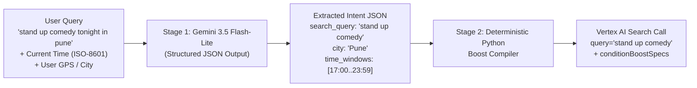

# Vertex AI Search — Real-Time Query Understanding & Dynamic Boosting

This directory contains the sample dataset generator, Vertex AI Search (Discovery Engine) datastore setup, and `boostSpec` evaluation suite for movies and live entertainment events.

## 1. Configuration & Setup

All project-specific identifiers and credentials are loaded from `config.local.json` (git-ignored) or environment variables via [`config.py`](./config.py).

```bash
# Copy the template and populate your GCP project & Vertex AI Search IDs
cp config.example.json config.local.json
```

| Config Key / Env Var | Description |
| :--- | :--- |
| `PROJECT_ID` | Google Cloud Project ID |
| `PROJECT_NUMBER` | Google Cloud Project Number |
| `LOCATION` | Discovery Engine location (default: `global`) |
| `VERTEX_LOCATION` | Vertex AI Gemini endpoint location (default: `us-central1`) |
| `DATASTORE_ID` | Vertex AI Search Data Store ID |
| `ENGINE_ID` | Vertex AI Search Engine / App ID |
| `BUCKET_NAME` | GCS bucket name for JSONL dataset upload |
| `GCS_BLOB_PATH` | GCS object path (default: `sample_data/sample_metadata_200.jsonl`) |

### Key Indexed Schema Fields
* **Geolocation (`GEOLOCATION`)**: `location_city` (supports `location_city:GEO_DISTANCE("lat,lng", radius_meters)` or `location_city:GEO_DISTANCE(lat, lng, radius_meters)`)
* **Datetime (`DATETIME`, RFC3339 with `+05:30` offset)**: `showtime_start`, `showtime_end`, `release_date`, `available_time`, `createdAt`
* **Text / Keyword Arrays**: `record_type` (`"movie"` | `"event"`), `languages`, `searchKeywords`, `hash_tags`, `formats`, `screen_types`, `city`, `title`, `synopsis`, `cast`, `genre`

---

## 2. How `GEO_DISTANCE` Boosting Works (Why Concentric Rings Are Needed)

In Vertex AI Search, `location_city:GEO_DISTANCE(lat, lng, radius_meters)` inside `conditionBoostSpecs` is a **boolean circle predicate**—it is **not** a continuous distance-decay function:
* Every document inside `radius_meters` gets the exact same flat boost.
* If you set `radius_meters = 5000000` (`5,000 km`), every Indian city (`Chennai`, `Goa`, `Mumbai`, `Kolkata`, `Delhi NCR`) falls inside the circle and receives the same boost, so the relative ranking does not change.

### Solution: Concentric `GEO_DISTANCE` Rings
By stacking multiple concentric circles in `conditionBoostSpecs`, closer documents match multiple conditions and accumulate a higher cumulative boost:

```json
[
  {"condition": "location_city:GEO_DISTANCE(13.0827, 80.2707, 100000)",  "boost": 0.4},
  {"condition": "location_city:GEO_DISTANCE(13.0827, 80.2707, 800000)",  "boost": 0.3},
  {"condition": "location_city:GEO_DISTANCE(13.0827, 80.2707, 1150000)", "boost": 0.2},
  {"condition": "location_city:GEO_DISTANCE(13.0827, 80.2707, 1500000)", "boost": 0.1}
]
```

* **Chennai (`3.3 km`)**: Matches all 4 rings $\rightarrow$ `#1`
* **Goa (`744.3 km`)**: Matches 3 rings (`800km`, `1150km`, `1500km`) $\rightarrow$ `#2`
* **Mumbai (`1031.8 km`)**: Matches 2 rings (`1150km`, `1500km`) $\rightarrow$ `#3`
* **Kolkata (`1355.6 km`)**: Matches 1 ring (`1500km`) $\rightarrow$ `#4`
* **Delhi NCR (`1746.3 km`)**: Matches 0 rings $\rightarrow$ `#5`

---

## 3. Real-Time Query-to-Boost Translation Architecture

In production, **never ask an LLM to write raw Vertex AI Search `boostSpec` filter strings directly** (it can hallucinate field names, miss quotes, or write invalid date/geo syntax).

Instead, use a **2-stage real-time pipeline** (~150–250ms total latency):



### Stage 1: Fast Structured Extraction (`gemini-3.5-flash-lite`)
Pass the **current timestamp & day of week** in the system prompt so Gemini resolves relative dates (`"tonight"`, `"tomorrow before 11"`, `"this friday"`, `"this weekend"`, `"next week"`, `"gandhi jayanti holiday"`, `"every saturday in october"`) into exact ISO-8601 start/end windows, and constrain its output with `response_schema` (Pydantic):

```python
from datetime import datetime
from typing import Literal, Optional
from pydantic import BaseModel, Field
from google import genai
from google.genai import types


class TimeWindow(BaseModel):
    start_iso: str = Field(
        description="ISO-8601 start time with +05:30 offset, e.g. 2026-10-07T17:00:00+05:30"
    )
    end_iso: str = Field(
        description="ISO-8601 end time with +05:30 offset, e.g. 2026-10-07T23:59:59+05:30"
    )


class ExtractedSearchIntent(BaseModel):
    search_query: str = Field(
        description=(
            "Clean core query for Vertex AI Search (what the user wants, e.g. "
            "'open mic', 'stand up comedy', 'movie', 'events', 'pottery workshop')"
        )
    )
    record_type: Optional[Literal["movie", "event"]] = None
    city: Optional[
        Literal[
            "Mumbai",
            "Delhi NCR",
            "Bengaluru",
            "Hyderabad",
            "Chennai",
            "Pune",
            "Kolkata",
            "Goa",
        ]
    ] = None
    languages: list[str] = Field(
        default_factory=list,
        description="Title-cased languages, e.g. ['Telugu', 'Hindi']",
    )
    audience: Optional[Literal["kids", "family", "adults"]] = None
    keywords: list[str] = Field(
        default_factory=list,
        description="Lowercase genre/topic keywords for searchKeywords",
    )
    hash_tags: list[
        Literal[
            "MORNING_SHOW",
            "LATE_NIGHT_SHOW",
            "NEW_RELEASE",
            "FRIDAY_RELEASE",
            "UPCOMING_MOVIE",
            "KIDS_EVENT",
            "OPEN_MIC",
            "STANDUP_COMEDY",
            "GARBA_NIGHT",
            "NEW_YEAR_EVE",
            "STAGE_PLAY",
            "POTTERY_WORKSHOP",
        ]
    ] = Field(default_factory=list)
    date_field: Literal["showtime_start", "release_date"] = Field(
        default="showtime_start",
        description="Use 'release_date' when query asks for 'releasing' or 'upcoming' movies; otherwise 'showtime_start'",
    )
    time_windows: list[TimeWindow] = Field(default_factory=list)


def extract_query_intent(user_query: str, now_iso: str = "2026-10-07T07:40:00+05:30") -> ExtractedSearchIntent:
    from config import GEMINI_MODEL, PROJECT_ID, VERTEX_LOCATION

    client = genai.Client(vertexai=True, project=PROJECT_ID, location=VERTEX_LOCATION)
    prompt = f"""You are a real-time search query parser for an entertainment & ticketing platform.
Current timestamp: {now_iso} (Wednesday, October 7, 2026).
Extract the search intent, canonical city, record_type, languages, keywords, hash_tags, and exact ISO-8601 time_windows (+05:30) from the user query.
- For 'tonight': today 17:00:00 to 23:59:59
- For 'morning': 06:00:00 to 12:00:00 (or before specific hour if stated, e.g. 'before 11' -> 06:00:00 to 11:00:00)
- For 'late night / after 10 pm': 22:00:00 to next day 03:00:00
- For 'this weekend': Saturday 2026-10-10T00:00:00+05:30 to Sunday 2026-10-11T23:59:59+05:30
- For recurring days like 'every saturday in october': output one TimeWindow per Saturday in October.

User Query: {user_query!r}"""

    response = client.models.generate_content(
        model=GEMINI_MODEL,
        contents=prompt,
        config=types.GenerateContentConfig(
            response_mime_type="application/json",
            response_schema=ExtractedSearchIntent,
            temperature=0.0,
        ),
    )
    return ExtractedSearchIntent.model_validate_json(response.text)
```

---

### Stage 2: Deterministic Python Boost Compiler
Your backend takes the validated `ExtractedSearchIntent` object and deterministically builds `conditionBoostSpecs` using the datastore schema (`location_city`, `showtime_start`, `release_date`, `languages`, `searchKeywords`, `hash_tags`):

```python
CITY_COORDS = {
    "Mumbai": (18.9946, 72.8245),
    "Delhi NCR": (28.6139, 77.2090),
    "Bengaluru": (12.9716, 77.5946),
    "Hyderabad": (17.3850, 78.4867),
    "Chennai": (13.0827, 80.2707),
    "Pune": (18.5204, 73.8567),
    "Kolkata": (22.5726, 88.3639),
    "Goa": (15.4989, 73.8278),
}


def compile_boost_specs(
    intent: ExtractedSearchIntent,
    user_latlng: Optional[tuple[float, float]] = None,
) -> list[dict]:
    specs = []

    # 1. Record Type + Language Boost
    type_clauses = []
    if intent.record_type:
        type_clauses.append(f'record_type: ANY("{intent.record_type}")')
    if intent.languages:
        langs = ", ".join(f'"{l}"' for l in intent.languages)
        type_clauses.append(f"languages: ANY({langs})")
    if type_clauses:
        specs.append({"condition": " AND ".join(type_clauses), "boost": 0.6})

    # 2. Genre / Audience Keywords & Hashtags Boost
    if intent.keywords or intent.hash_tags:
        kw_clauses = []
        if intent.keywords:
            kws = ", ".join(f'"{k.lower()}"' for k in intent.keywords)
            kw_clauses.append(f"searchKeywords: ANY({kws})")
        if intent.hash_tags:
            tags = ", ".join(f'"{t}"' for t in intent.hash_tags)
            kw_clauses.append(f"hash_tags: ANY({tags})")
        specs.append({"condition": " OR ".join(kw_clauses), "boost": 0.6})

    # 3. Location Boost (Explicit city in query OR fallback to user's GPS concentric rings)
    if intent.city and intent.city in CITY_COORDS:
        lat, lng = CITY_COORDS[intent.city]
        specs.append({
            "condition": f"location_city:GEO_DISTANCE({lat}, {lng}, 50000)",
            "boost": 0.8,
        })
    elif user_latlng:
        lat, lng = user_latlng
        # Concentric rings for proximity ranking when no city is explicitly named
        for radius_m, boost_val in [(50000, 0.4), (300000, 0.3), (800000, 0.2), (1500000, 0.1)]:
            specs.append({
                "condition": f"location_city:GEO_DISTANCE({lat}, {lng}, {radius_m})",
                "boost": boost_val,
            })

    # 4. Date / Time Window Boost (supports single range OR recurring days like 'every Saturday')
    if intent.time_windows:
        field = intent.date_field
        window_clauses = [
            f'({field} >= "{w.start_iso}" AND {field} <= "{w.end_iso}")'
            for w in intent.time_windows
        ]
        specs.append({
            "condition": " OR ".join(window_clauses),
            "boost": 0.9,
        })

    return specs
```

### Why This Pipeline Works in Production
1. **Handles Hinglish, Vague, and Holiday Queries Automatically**:
   * `"is weekend delhi mein kya chal raha hai"` $\rightarrow$ extracts `search_query="events"`, `city="Delhi NCR"`, `time_windows=[Sat 00:00 .. Sun 23:59]`.
   * `"plays on gandhi jayanti holiday"` $\rightarrow$ resolves Gandhi Jayanti to `2026-10-02` and extracts `search_query="play theatre"`.
   * `"pottery classes every saturday in october"` $\rightarrow$ emits a `TimeWindow` for each Saturday in October, and `compile_boost_specs()` joins them with `OR`.
2. **Zero Filter Syntax Errors**: Python constructs the `GEO_DISTANCE(...)`, `ANY(...)`, and `>=` expressions from validated fields, so Vertex AI Search never receives malformed filter syntax.
3. **Low Latency**: `gemini-3.5-flash-lite` provides fast structured extraction, and the Vertex AI Search REST call takes **~150–300ms**.

---

## 4. Benchmark Evaluation Summary (12 Queries)

All 12 queries and their baseline vs. boosted outputs are implemented and logged in [`query_with_boost.py`](./query_with_boost.py):

| # | User Query | Extracted Fields | Boost Condition Applied (`conditionBoostSpecs`) | Ranking Improvement (Baseline $\rightarrow$ Boosted) |
| :--- | :--- | :--- | :--- | :--- |
| **Q1** | `open mic next week` | `what: open mic`, `when: next week` | `searchKeywords: ANY("open mic")` + `showtime_start` in `2026-10-12..18` | Nov 22 distractor (`etm100100z`) drops from **#1 $\rightarrow$ #3**; Oct 16 & Oct 14 open mics move to **#1 & #2** |
| **Q2** | `stand up comedy tonight in pune` | `what: stand up comedy`, `when: tonight`, `where: pune` | `location_city:GEO_DISTANCE(18.5204, 73.8567, 50000)` + `showtime_start` tonight (`2026-10-07`) | Tonight's Pune shows (`etm100104z`, `etm100103z`, `5.2km`) take **#1 & #2**, followed by Pune show (`etm100032z`, `5.2km`) at **#3** ahead of Mumbai (`122.2km`) |
| **Q3** | `movies releasing this friday` | `what: movie`, `sort: latest`, `when: this friday` | `record_type: ANY("movie")` + `release_date` on `2026-10-09` + `hash_tags: ANY("FRIDAY_RELEASE")` | Older Sep 11 release (`MV00101`) drops from **#1 $\rightarrow$ #3**; Oct 9 Friday releases (`MV00102`, `MV00103`) move to **#1 & #2** |
| **Q4** | `kids events this sunday morning` | `what: events`, `audience: kids`, `when: sunday morning` | `record_type: ANY("event") AND searchKeywords: ANY("kids", ...)` + `showtime_start` on `2026-10-11T06:00..12:00` | General evening festivals (`etm100113z`, `etm100114z`) drop out of top 4; Sunday morning kids workshops (`etm100106z` 10:00 AM, `etm100105z` 09:30 AM) rise to **#1 & #2** |
| **Q5** | `late night shows after 10 pm` | `what: movie`, `when: after 10 pm` | `record_type: ANY("movie") AND hash_tags: ANY("LATE_NIGHT_SHOW")` + `showtime_start >= 22:00` | Morning/evening shows (`MV00017` 09:30 AM, `MV00077` 19:15 PM) are replaced at **#1–#4** by post-10 PM shows (`MV00106` 23:15, `MV00105` 22:45, `MV00045` 22:30, `MV00018` 22:30) |
| **Q6** | `garba nights between 10th and 20th october` | `what: garba night`, `when: 10th to 20th october` | `searchKeywords: ANY("garba", ...)` + `showtime_start` in `2026-10-10..20` | Oct 12 (`etm100108z`) and Oct 17 (`etm100109z`) Garba Nights rank **#1 & #2** ahead of the Oct 28 distractor (`etm100107z`) |
| **Q7** | `new year eve parties in goa` | `what: party`, `when: new year eve`, `where: goa` | `location_city:GEO_DISTANCE(15.4989, 73.8278, 50000)` + `showtime_start` on `2026-12-31` | Mumbai NYE party (`etm100110z`, `404.8km`) drops from **#1 $\rightarrow$ #3**; Goa NYE parties (`etm100112z`, `etm100111z`, `15.3km`) move to **#1 & #2** |
| **Q8** | `is weekend delhi mein kya chal raha hai` | `what: events`, `when: this weekend`, `where: delhi` | `record_type: ANY("event") AND location_city:GEO_DISTANCE(28.6139, 77.2090, 50000)` + `showtime_start` in `2026-10-10..11` | Delhi NCR weekend events (`etm100113z` Oct 10, `etm100114z` Oct 11, `4.2km`) rank **#1 & #2** |
| **Q9** | `upcoming telugu movies next month` | `what: movie`, `language: telugu`, `when: next month` | `record_type: ANY("movie") AND languages: ANY("Telugu")` + `release_date` in `2026-11-01..30` | Oct 1 release (`MV00107`) drops from **#2 $\rightarrow$ #4**; all three Nov 2026 Telugu releases (`MV00108`, `MV00110`, `MV00109`) take **#1, #2, #3** |
| **Q10** | `morning shows tomorrow before 11` | `what: movie`, `when: tomorrow before 11` | `record_type: ANY("movie") AND hash_tags: ANY("MORNING_SHOW")` + `showtime_start` in `2026-10-08T06:00..11:00` | Tomorrow's morning shows (`MV00112` at `09:00` and `MV00113` at `10:15` on `2026-10-08`) jump to **#1 & #2** ahead of other dates |
| **Q11** | `plays on gandhi jayanti holiday` | `what: play`, `when: 2nd october` | `searchKeywords: ANY("play", "theatre", ...)` + `showtime_start` on `2026-10-02` | Oct 25 play (`etm100115z`) drops from **#2 $\rightarrow$ #3**; both Oct 2 Gandhi Jayanti plays (`etm100117z`, `etm100116z`) rank **#1 & #2** |
| **Q12** | `pottery classes every saturday in october` | `what: pottery workshop`, `when: every saturday in october` | `searchKeywords: ANY("pottery", ...)` + `hash_tags: ANY("SATURDAY_OCTOBER")` / Saturday `showtime_start` ranges | Saturday October pottery workshops (`etm100119z` Oct 10, `etm100120z` Oct 17) rank **#1 & #2** ahead of the Nov 11 Wednesday workshop (`etm100118z`) |

---

## 5. Latency Benchmark Report: Single Query vs. Real-Time Query Resolution

The dedicated benchmark script [`realtime_query_benchmark.py`](./realtime_query_benchmark.py) measures live latencies (after TCP/mTLS connection warm-up) across two execution modes for all 12 queries:

1. **Single Query Mode (`Single Query (ms)`)**: Direct Vertex AI Search API call (`engines/{ENGINE_ID}/servingConfigs/default_search:search`) with a pre-built query and `boostSpec`.
2. **Real-Time Query Resolution Mode (`RT Total E2E (ms)`)**:
   * **LLM Extract (`LLM Extract (ms)`)**: Live call to `gemini-3.5-flash-lite` (`us-central1`, `thinkingBudget: 0`, structured `responseSchema`) to parse the raw natural-language query into `ExtractedSearchIntent`.
   * **Boost Compile (`Compile (ms)`)**: Deterministic Python `compile_boost_specs(intent)` execution.
   * **RT Search (`RT Search (ms)`)**: Live Vertex AI Search API call using the dynamically extracted `search_query` and compiled `conditionBoostSpecs`.

### 5.1 Per-Query Latency Breakdown

| ID | User Query | Single Query (ms) | LLM Extract (ms) | Compile (ms) | RT Search (ms) | RT Total E2E (ms) | Real-Time Top-1 Result |
| :--- | :--- | ---: | ---: | ---: | ---: | ---: | :--- |
| **Q1** | `open mic next week` | `353.7 ms` | `1746.2 ms` | `0.044 ms` | `348.7 ms` | **`2094.9 ms`** | `[etm100102z]` BLR Brewing Acoustic & Standup Open Mic (Bengaluru) |
| **Q2** | `stand up comedy tonight in pune` | `348.9 ms` | `1679.5 ms` | `0.014 ms` | `328.9 ms` | **`2008.4 ms`** | `[etm100104z]` Bassi Kisi Ko Batana Mat Stand Up Comedy (Pune) |
| **Q3** | `movies releasing this friday` | `331.4 ms` | `1857.2 ms` | `0.010 ms` | `362.9 ms` | **`2220.1 ms`** | `[MV00102]` Bhool Bhulaiyaa 4 (Delhi NCR) |
| **Q4** | `kids events this sunday morning` | `313.3 ms` | `2254.1 ms` | `0.007 ms` | `312.5 ms` | **`2566.6 ms`** | `[etm100106z]` Junior Robotics & Science Kids Workshop (Bengaluru) |
| **Q5** | `late night shows after 10 pm` | `260.4 ms` | `2283.0 ms` | `0.023 ms` | `318.9 ms` | **`2601.9 ms`** | `[MV00106]` The Batman Part II (Bengaluru) |
| **Q6** | `garba nights between 10th and 20th october` | `277.4 ms` | `1807.5 ms` | `0.017 ms` | `272.4 ms` | **`2079.9 ms`** | `[etm100108z]` Falguni Pathak Navratri Garba Nights (Mumbai) |
| **Q7** | `new year eve parties in goa` | `328.6 ms` | `2292.9 ms` | `0.022 ms` | `275.9 ms` | **`2568.9 ms`** | `[etm100112z]` Thalassa Sunset to Sunrise NYE Party (Goa) |
| **Q8** | `is weekend delhi mein kya chal raha hai` | `259.0 ms` | `1708.1 ms` | `0.050 ms` | `286.0 ms` | **`1994.2 ms`** | `[etm100113z]` Delhi Sufi & Street Food Festival (Delhi NCR) |
| **Q9** | `upcoming telugu movies next month` | `289.5 ms` | `1633.1 ms` | `0.029 ms` | `380.9 ms` | **`2014.0 ms`** | `[MV00108]` Devara Part 2: Red Sea (Hyderabad) |
| **Q10** | `morning shows tomorrow before 11` | `269.1 ms` | `1648.8 ms` | `0.010 ms` | `745.0 ms` | **`2393.8 ms`** | `[MV00112]` Chhaava: The Great Warrior (Mumbai) |
| **Q11** | `plays on gandhi jayanti holiday` | `270.7 ms` | `2274.4 ms` | `0.022 ms` | `274.9 ms` | **`2549.3 ms`** | `[etm100117z]` Tughlaq: Theatre Play (Mumbai) |
| **Q12** | `pottery classes every saturday in october` | `275.3 ms` | `2282.3 ms` | `0.031 ms` | `270.7 ms` | **`2553.0 ms`** | `[etm100119z]` Claystation Wheel Pottery Classes (Bengaluru) |
| **AVG** | **Average across 12 queries** | **`298.1 ms`** | **`1955.6 ms`** | **`0.023 ms`** | **`348.1 ms`** | **`2303.7 ms`** | **12 / 12 target Top-1 matches** |
| **P50** | **Median (P50) Latency** | **`289.5 ms`** | — | — | — | **`2393.8 ms`** | — |
| **P95** | **95th Percentile (P95) Latency** | **`353.7 ms`** | — | — | — | **`2601.9 ms`** | — |

### 5.2 Key Latency Takeaways
* **Direct Vertex AI Search (`Single Query`)**: Averages **`298.1 ms`** (`P50: 289.5 ms`, `259–354 ms` range from India to `global` / `us-central1` over mTLS).
* **Deterministic Python Boost Compiler (`compile_boost_specs`)**: Averages **`0.023 ms`** (`23 microseconds`), adding virtually zero overhead.
* **Real-Time LLM Intent Extraction (`gemini-3.5-flash-lite`)**: Averages **`1955.6 ms`** across the 12 queries over mTLS to `us-central1`.
* **Accuracy**: All 12 dynamically compiled real-time queries (`Q1`–`Q12`) returned a valid target document at **#1** with zero filter syntax errors.

---

## 6. DataStore Document CRUD Operations (Create, Insert, Modify, Delete)

While [`setup_gcs_datastore.py`](./setup_gcs_datastore.py) configures a 4-hour periodic GCS sync (`refreshInterval: 14400s`), real-time changes to individual movies or events (new listings, sold-out status updates, showtime changes, or cancellations) can be applied **immediately** via the Discovery Engine `documents` REST API in [`manage_datastore_documents.py`](./manage_datastore_documents.py).

**Base Documents Endpoint:**
```text
https://discoveryengine.googleapis.com/v1alpha/projects/{PROJECT_ID}/locations/{LOCATION}/collections/default_collection/dataStores/{DATASTORE_ID}/branches/default_branch/documents
```

### 6.1 Summary of Document REST Operations

| Operation | HTTP Method & Endpoint | Payload / Behavior |
| :--- | :--- | :--- |
| **Create Single Document** | `POST .../documents?documentId={DOC_ID}` | `{"id": "{DOC_ID}", "schemaId": "default_schema", "structData": {...}}` — Creates a new document immediately (returns `409` if ID exists). |
| **Batch Insert / Upsert (`<= 100` docs)** | `POST .../documents:import` | `{"inlineSource": {"documents": [...]}, "reconciliationMode": "INCREMENTAL"}` — Atomically inserts or updates up to 100 documents inline without GCS staging. |
| **Bulk GCS Import** | `POST .../documents:import` | `{"gcsSource": {"inputUris": ["gs://.../*.jsonl"], "dataSchema": "custom"}, "reconciliationMode": "INCREMENTAL" \| "FULL"}` |
| **Get Document** | `GET .../documents/{DOC_ID}` | Returns full `Document` resource including `structData` and `indexTime`. |
| **Modify / Update Document** | `PATCH .../documents/{DOC_ID}?allowMissing=true` | `{"id": "{DOC_ID}", "schemaId": "default_schema", "structData": {...}}` — Replaces `structData`. For partial field updates, `GET` existing `structData`, merge the modified fields, and `PATCH`. |
| **Delete Single Document** | `DELETE .../documents/{DOC_ID}` | Immediately removes the document from the DataStore (`GET` afterwards returns `404 NOT_FOUND`). |

### 6.2 Code Examples (`manage_datastore_documents.py`)

#### A. Create a Single Document (`POST .../documents?documentId={id}`)
```python
resp = session.post(
    f"{docs_url}?documentId={doc_id}",
    json={
        "id": doc_id,
        "schemaId": "default_schema",
        "structData": record_dict,
    },
)
```

#### B. Batch Insert Multiple Documents Inline (`POST .../documents:import`)
```python
resp = session.post(
    f"{docs_url}:import",
    json={
        "inlineSource": {
            "documents": [
                {"id": r["id"], "schemaId": "default_schema", "structData": r}
                for r in records
            ]
        },
        "reconciliationMode": "INCREMENTAL",
    },
)
```

#### C. Modify an Existing Document (`GET` + `PATCH .../documents/{id}`)
```python
existing = session.get(f"{docs_url}/{doc_id}").json()
merged_struct = {**existing.get("structData", {}), **field_updates}

resp = session.patch(
    f"{docs_url}/{doc_id}?allowMissing=false",
    json={
        "id": doc_id,
        "schemaId": "default_schema",
        "structData": merged_struct,
    },
)
```

#### D. Delete a Document (`DELETE .../documents/{id}`)
```python
resp = session.delete(f"{docs_url}/{doc_id}")
```

---

## 7. Usage

```bash
# 1. Regenerate the 234 sample records (sample_metadata_200.json & sample_metadata_200.jsonl)
python generate_sample_data.py

# 2. Run the full GEO_DISTANCE + 12-query static benchmark suite
python query_with_boost.py

# 3. Run the Single-Query vs. Real-Time Query Resolution latency benchmark
python realtime_query_benchmark.py

# 4. Run the Document CRUD workflow (inserts 10 records, modifies 3 existing records, deletes 3 records)
python manage_datastore_documents.py

# 5. Fetch or delete specific documents by ID
python manage_datastore_documents.py --get MV00201
python manage_datastore_documents.py --delete MV00204 MV00205 etm100205z

# 6. Run a custom ad-hoc query with a single boost condition
python query_with_boost.py \
  -q "Welcome to the Jungle" \
  -c "location_city:GEO_DISTANCE(13.0827, 80.2707, 100000)" \
  -b 0.8
```
